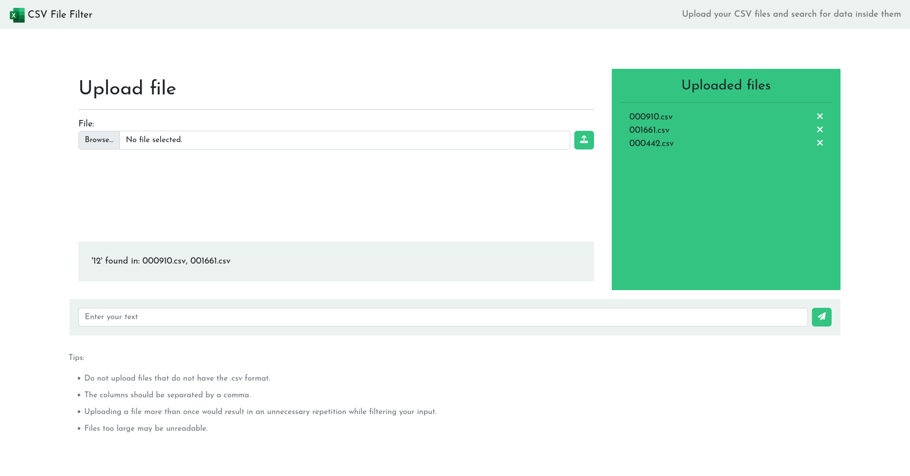

# CSV File Filter

## Apresentação:
App criado em Django e estliziado com CSS e Bootstrap, permite que o usuário filtre dados dentro de arquivos .csv.

## Preview:

### Website:

### Visualização em mobile:

## Tecnologias utilizadas 
- HTML
- CSS
- Bootstrap
- Python/Django
